# lc-oscillator-finder

ngspicejs script that finds new LC oscillator topologies

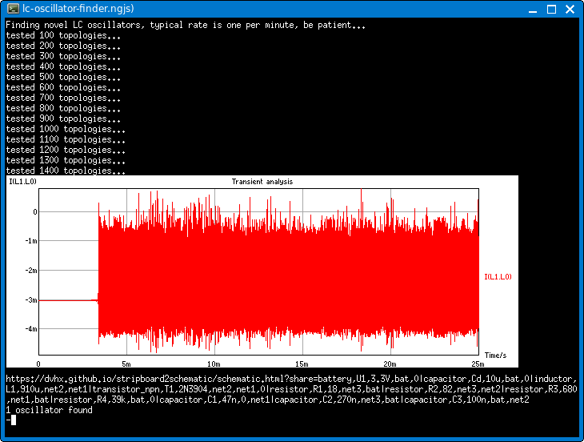

# Goal

- find different simple LC oscillators
- ideally find something completely new

# How to use it

1. Run script until it finds something
2. Get schematic (it prints url with schematic editor)
3. Simulate found circuit and manually remove unnecessary parts (as long as they don't affect oscilation)
    - combine parallel or series resistors
    - remove large resistors
    - short small resistors
    - remove small caps
    - short large caps

# Configuration file config.json

    {
        "seed": 0,                 // 0 = random, >0 = will always generate same topologies, used for testing
        "battery_voltage": 3.3,    // battery's voltage
        "battery_rs": 10,          // battery's internal resistance
        "inductor_l": "910u",      // inductor's inductance
        "inductor_rs": 6.5,        // inductor's series resistance
        "capacitor": "47n",        // at least one capacitor will have this value
        "npn_model": "2N3904",     // which NPN tranistor to use
        "counts": {                //
            "net": 3,              // how many internal nets
            "capacitor": 4,        // how many capacitors
            "resistor": 5,         // how many resistors
            "npn": 2               // how many npn transistors
        },
        "min_amplitude": 1e-7      // coil current amplitude above which it is considered to be oscillating
    }

# Output

All found oscillator is saved in "candidates" directory. One gif with coil current, .url file with link that 
contains schematic that can be opened in browser. And a ngjs script with netlist.

# My results

## 12 minimal LCCRT oscillators

I noticed that simplest oscillators had one coil, two caps, one resistor and one transistor. I called them
LCCRT oscillators. They always have 2 internal nodes. This allows for relatively small amount of combinations (~40'000) 
so I went through all of them and found that there are only 12 possible combinations that oscillate, here they are
split into 4 groups:

### LCCRT Group A
- Resistor powers **collector** and coil
- Coil is accros collector and base
- If capacitor is connected to battery or ground, it can be connected to opposite rail as well, this creates 4 combinations:

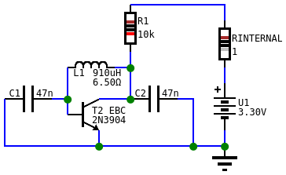
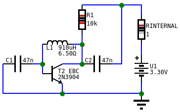
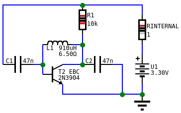
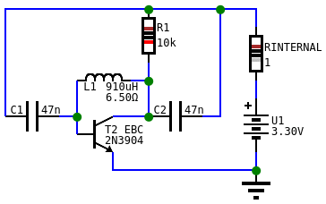

### LCCRT Group B
- Resistor powers **base** and coil
- Coil is accros collector and base
- If capacitor is connected to battery or ground, it can be connected to opposite rail as well, this creates 4 combinations:

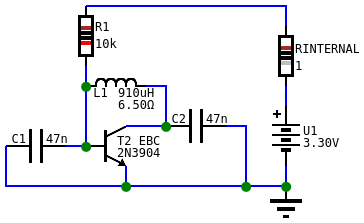

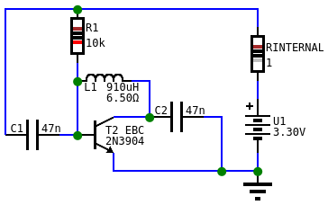
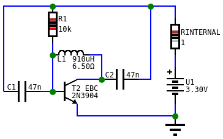

### LCCRT Group C
- Battery powers **collector** and coil directly, resistor is moved down to emitter
- Coil is accros collector and base
- C1 is not connected to battery or ground so it cannot be moved
- C2 has one and at ground so it can be moved to battery, this creates 2 combinations:

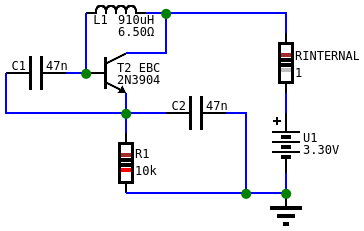
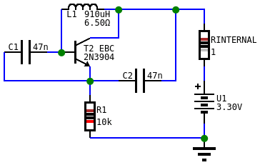

### LCCRT Group D
- Battery powers **base** and coil directly, resistor is moved down to emitter
- Coil is accros collector and base
- C1 is not connected to battery or ground so it cannot be moved
- C2 has one and at ground so it can be moved to battery, this creates 2 combinations:

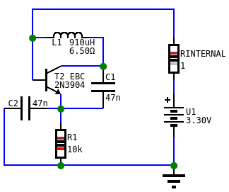
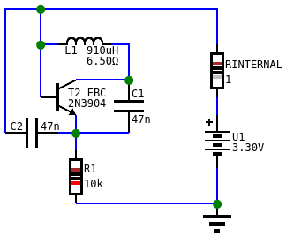

## Other non-LCCRT oscillators

Many different oscillators with more than 5 LCCRT components have been found, here are few of them. 
Some have quite narrow range of values where they oscillate.

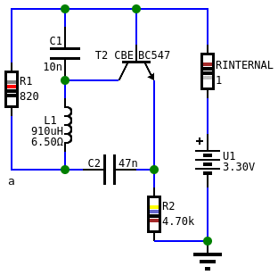
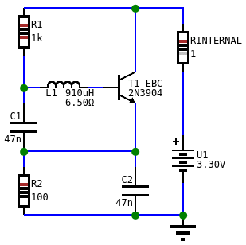
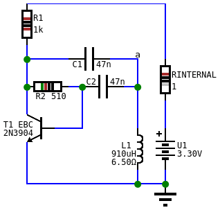
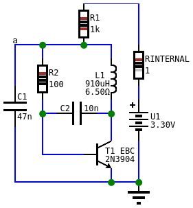
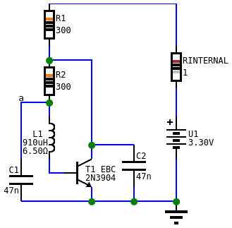

# All curves

- [Table with all oscillators and all curves](TABLE.md)

# Support

You can support development on [Patreon](https://www.patreon.com/DusanHalicky) or you can hire me via [Upwork](https://www.upwork.com/freelancers/~013b4c3d6e772fdb01)

