One big table with all the curves

| Schematic | Coil current | Voltages | Voltages (detail) | Currents
| :---: | :---: | :---: | :---: |  :---: |
| LCCRT1  | 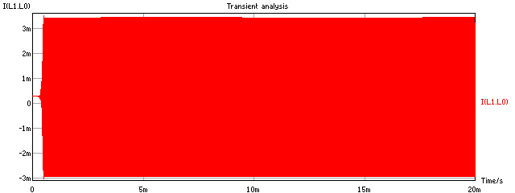 | 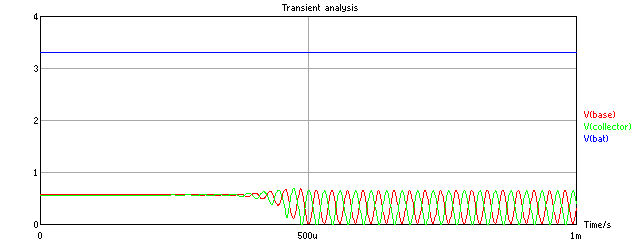 | 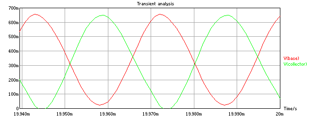 | 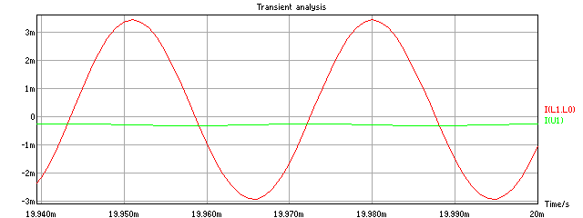 |
| LCCRT2  | 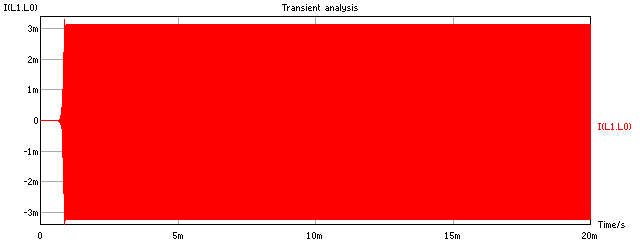 | 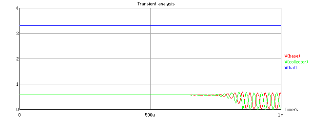 |  | 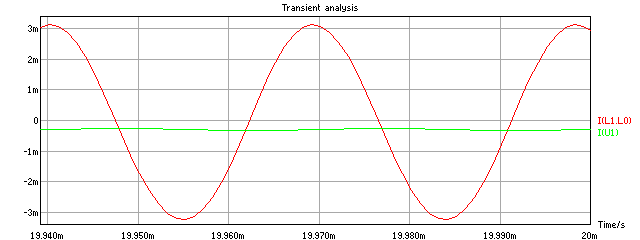 |
| LCCRT3  | 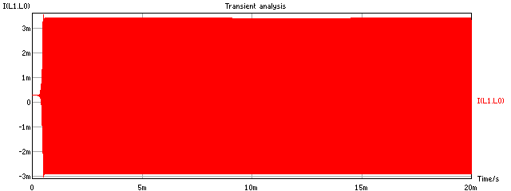 | 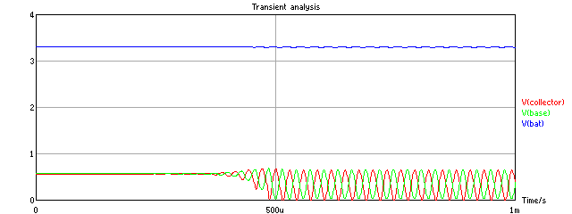 | 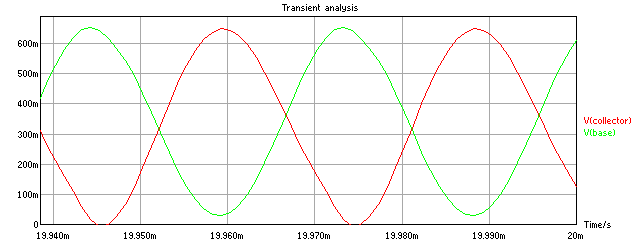 | 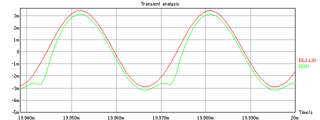 |
| LCCRT4  | 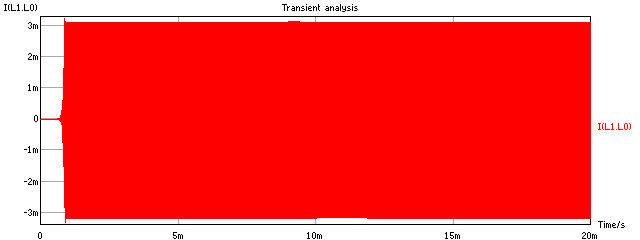 |  |  | 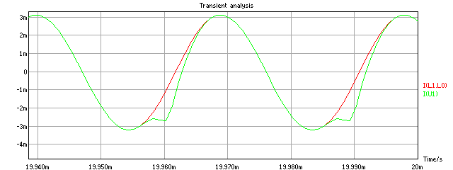 |
| LCCRT5  | 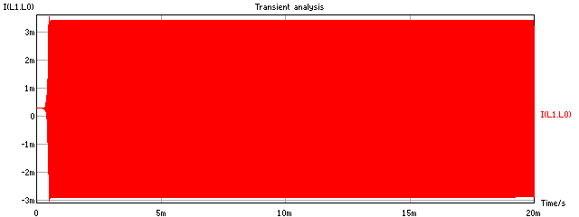 | 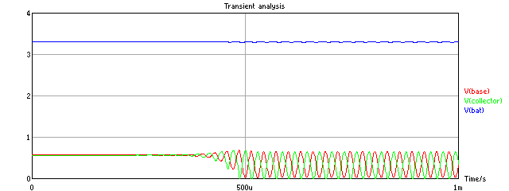 | 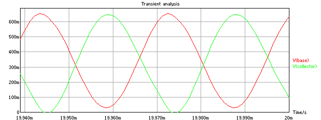 | 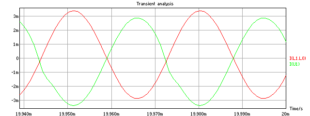 |
| LCCRT6  | 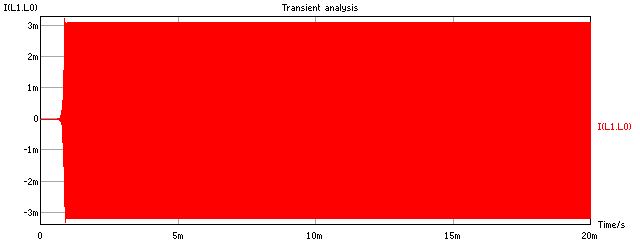 | 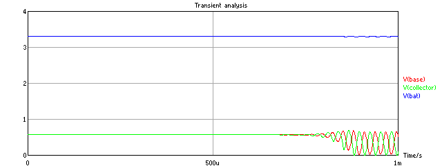 |  | 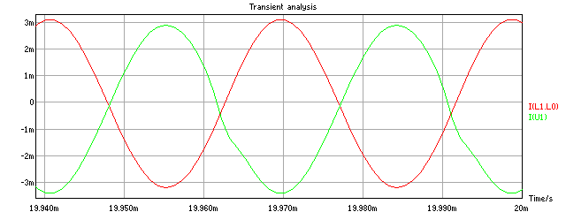 |
| LCCRT7  | 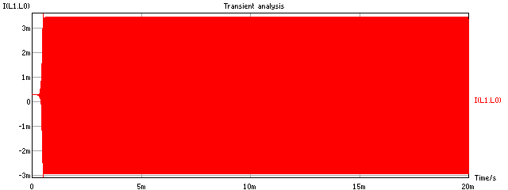 | 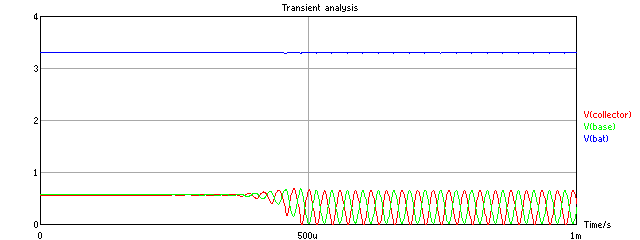 |  | 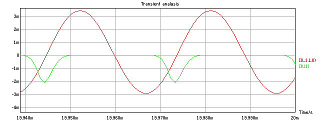 |
| LCCRT8  |  |  | 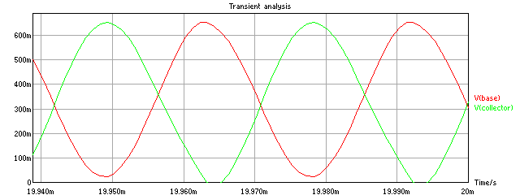 | 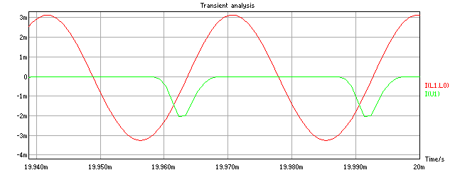 |
| LCCRT9  |  | 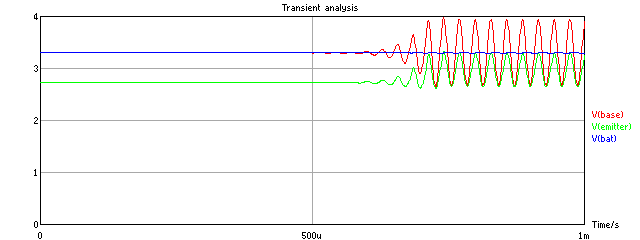 | 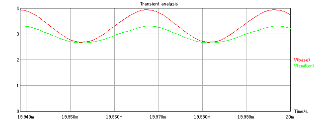 | 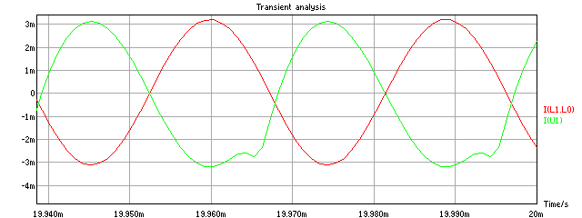 |
| LCCRT10  | 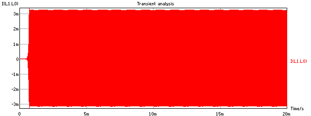 |  | 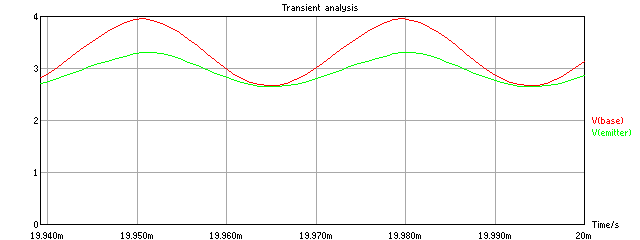 | 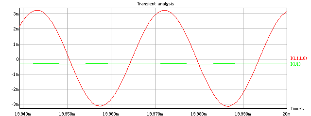 |
| LCCRT11  | 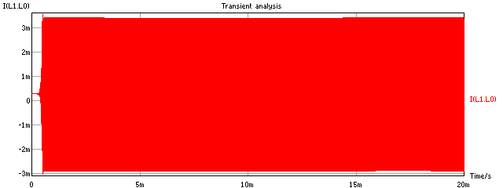 | 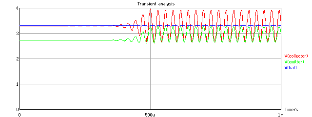 | 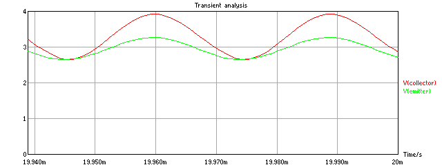 | 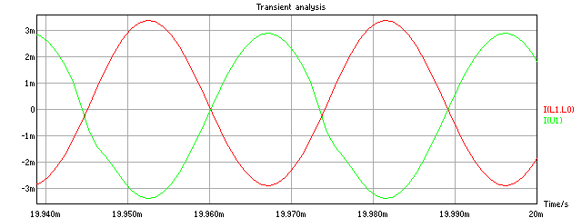 |
| LCCRT12  | 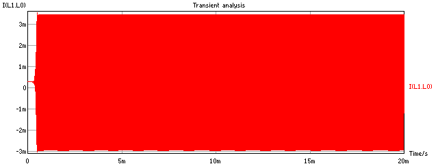 | 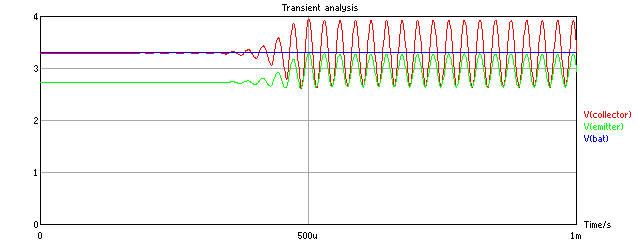 | 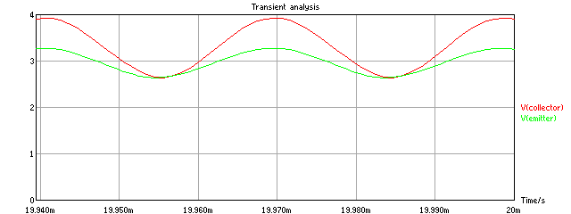 | 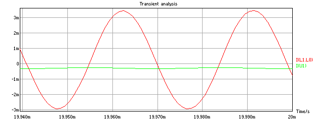 |
| OTHER1  | 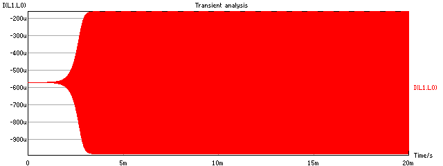 | 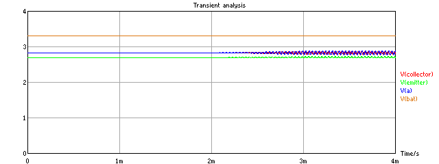 | 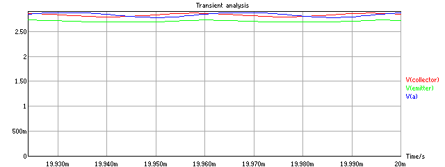 | 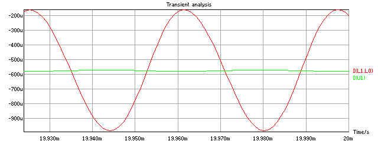 |
| OTHER2  | 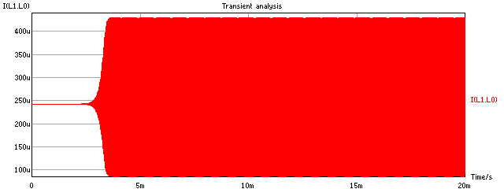 | 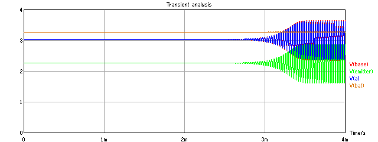 | 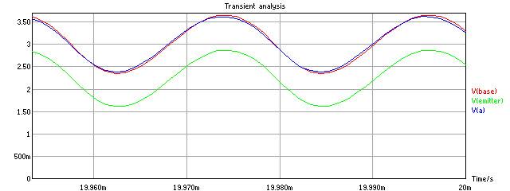 | 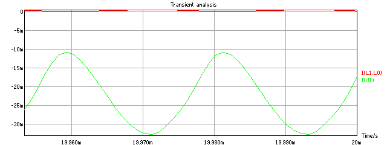 |
| OTHER3  | 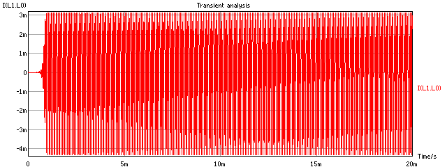 | 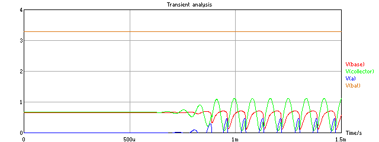 | 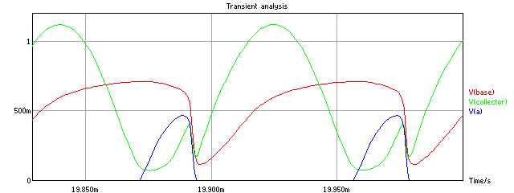 |  |
| OTHER4  |  |  |  |  |
| OTHER5  |  |  |  |  |
